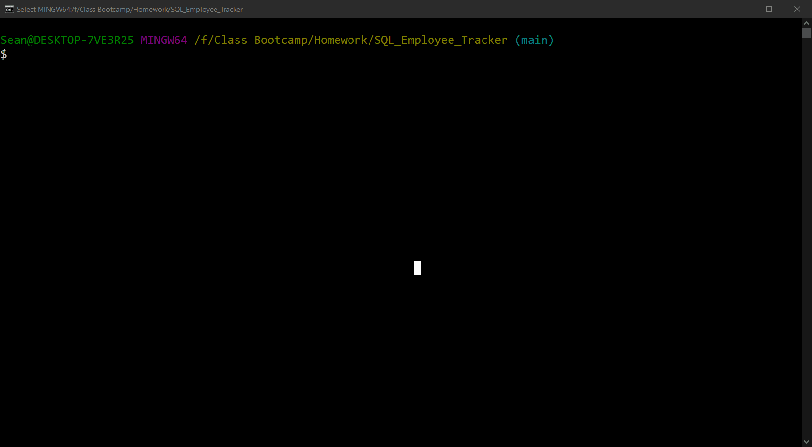

# Employee Tracker

## Licensing:

- [Description](#description)
- [Demo](#demo)
- [Installation](#installation)
- [Usage](#usage)
- [Additional Info](#additional-info)

## Description:
Here is a basic Employee Tracker that uses SQL and Inquirer to display a table with all employee information. The app is done completely within a CLI and can store basic information about an employee such as what their role in a company is or how much their salary is. 

## Demo:

## Installation:
To install, simply copy the contents of this repository into a folder. Once in that folder, install the necessary required npm packages by typing "npm i" in the command line. 

## Usage:
To start the application, navigate to the folder through a terminal window and run "node index.js". The terminal will display prompts for the user to answer. You are able to view all departments, view all roles and view all employees which will display a table with all requrested data. Additionally, you can select options to add an employee, add a department, add a role or delete an employee. Simply follow the on-screen instructions and a table with updated information will be displayed once complete. 

## Additional Info:
- Github: [Mctastic](https://github.com/mctastic)
- Email: mctastic2121@gmail.com 